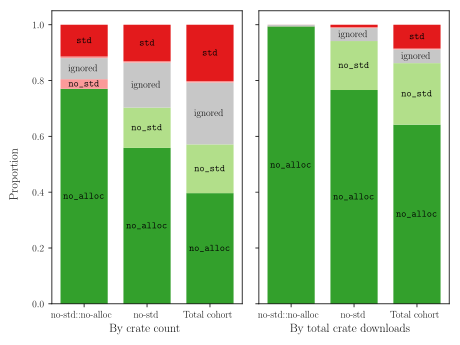
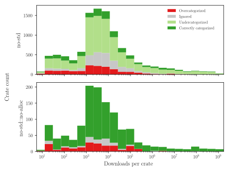
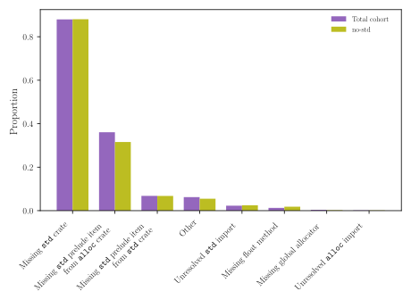
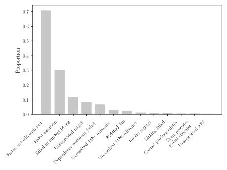

#+TITLE: How ~no_std~ are ~no_std~ Rust crates really? A survey
#+DATE: 2026-08-23

Imagine you're writing some Rust code for an embedded device that, by virtue of not having an operating system, can't have a full standard library in the form of the ~std~ crate. You come across a crate that provides functionality you're needing for your next feature, and it purports to be ~no_std~ compatible. Perhaps it even has an ~std~ feature, which you instinctively disable. Soon enough you've plugged it into your codebase, ~cargo check~ is happy, and you try to cross-compile it for your embedded target. And that's when the compiler, trying to pull in ~std~, informs you that you've been swindled and the crate isn't ~no_std~ compatible after all.

Perhaps my anecdote is overly dramatic, but this is a real problem, and I'd posit that it's one which surprisingly many embedded developers are familiar with. In this article, I present the results of a survey of the [[https://crates.io/][crates.io]] ecosystem, examining the pervasiveness of this problem, the most common causes of incompatibility, and some other interesting related insights. Most readers can freely skip the methodology section, and those with very little time are welcomed to only read the executive summary.

* Executive summary

- Overcategorization of crates that are ~no_std~ incompatible as ~no-std~ is a fairly pervasive issue, at 13.1% of all ~no-std~ categorized crates. However this accounts for just 0.891% of all ~no-std~ crate downloads.

- Undercategorization of crates that are ~no_std~ or ~no_alloc~ compatible, but are not classified as such, is an extremely common issue, with the majority (53.2%) of ~no-std~ crates being eligible for the ~no-std::no-alloc~ category.

- Among the most downloaded overcategorized crates, many have gone multiple years without a new release, not having had the chance for their compatibility to be fixed.

- The most common causes of incompatibility are the omission of the ~#![no_std]~ attribute, as well as forgetting that certain items that are implicitly imported by the prelude (such as ~Vec~ or ~String~) must be manually imported for ~no_std~.

* Background

Rust provides four built-in crates, namely ~std~, ~alloc~, ~core~, and ~proc_macro~, the latter of which is irrelevant here. Any target lacking an operating system will lack the ~std~ crate, whereas the ~alloc~ crate can be opted in to or out of depending on whether heap allocation is desired. That decision mostly comes down to whether the target has enough RAM for a heap and how disastrous it would be to panic if it were to fill up. In this article, crates that only use ~core~ and ~alloc~ will be referred to as ~no_std~, whereas the subset of crates that can compile without ~alloc~ will be called ~no_alloc~.[fn::One could also opt out of using the ~core~ crate with the unstable ~#![no_core]~ attribute. But as this is nightly-only, incredibly niche, and difficult to automatically verify, this is not investigated in this survey.]

Tangential to this, crates.io allows crate authors to assign categories to their crates, aiding discoverability and giving prospective users some context at a glance. Two of these categories are ~no-std~ and ~no-std::no-alloc~, which correspond to our ~no_std~ and ~no_alloc~ labels respectively. The dataset is split into three groups, namely all crates with the ~no-std::no-alloc~ category, all crates with the ~no-std~ category, and all crates containing the string ~no_std~ in their source code. ~no_std::no_alloc~ is a subset of ~no_std~, which is in turn a subset of the total cohort.

Note that the crates.io categories are hyphenated (~no-std~), whereas the property of a crate as being able to compile without ~std~ uses underscores (~no_std~).

* Methodology

The dataset consists of the newest [[https://semver.org/][SemVer]][fn::Not to be confused with the newest chronological release.] release of each crate belonging to one of the three groups detailed in the previous section, that are not marked as a ~proc-macro~ crate.

To determine whether a crate is ~no_std~, my [[https://github.com/wojciech-graj/cargo-no-std][~cargo-no-std~]] tool was used. ~cargo-no-std~ attempts to build an executable for a target that lacks ~std~ and includes the relevant crate as a dependency. By providing or not providing a global allocator, determining whether the ~alloc~ crate is used is also possible. The crates were built for the ~x86_64-unknown-none~ target and the ~-soft-float,+sse2~ target features to ensure sufficient floating point support[fn::It could be argued that a target with better float support, such as ~thumbv7m-none-eabihf~, would be a better choice. However, with these flags, floating point operations appeared to compile successfully on x86_64.].

Support for ~no_std~ or ~no_alloc~ is often feature-gated, hence the crates were tested without default features. Although it is most common to have a feature enabling the usage of either ~alloc~ or ~std~, many crates also have features named ~no_std~ or ~no_alloc~, which disable the use of these crates. Thus, the crates were tested with all features containing both of ~no~ and ~std~ when testing for ~no_std~ compatibility, or ~no~ and ~alloc~ or ~no~ and ~std~ in the case of ~no_alloc~.

To give the crates the best possible chances at successful compilation, the nightly toolchain was used, and all failing crates were re-tried with their default features enabled. Additionally, if a crate failed to compile with ~std~, it was automatically ignored.

Finally, common categories of compilation errors were manually identified, and the failures were categorized based on their compilation errors. Certain errors were associated with false negative results, and all crates that encountered any of these errors were categorized as "ignored". For example, this includes all crates that cannot compile on the x86_64 architecture.

This survey is based on a snapshot of crates.io from 2026-06-06. All of the code used to obtain these results can be found [[https://github.com/wojciech-graj/rust-no-std-survey][here]].

** Limitations

An automated survey of such a large number of crates makes it impossible to consider factors specific to individual crates, that could lead to their misidentification. The automatic setting of flags was done using a simple heuristic based on the most common approach to feature-gating ~no_std~ compliance, but does not consider any crates that have a different approach.

Ignoring of some crates means that there's significant uncertainty in the data, and while an effort was made to attempt to remedy the most common reasons for ignoring them, certain factors like compiling for the wrong target or the lack of certain tools at build time were not feasible to remedy at scale.

When analyzing the specific causes on incompatibility, 5.50% of all incompatible ~no-std~ crates had the cause of their failure to compile categorized as "Other". While overarching categories of errors could be found for the majority of failures, it was impractical to try to split the remainder further. This does however mean that a subset of these may be false-positives.

A best-effort manual inspection was performed over the compilation error logs for a subset of the crates, and didn't result in the identification of a large number of misidentified crates.

* Results

** Dataset at a glance

This survey analyzed 27310 crates, of which 11051 were categorized as ~no-std~, and 1246 of these were marked as ~no-std::no-alloc~. The total cohort represents just 9.78% of the 279204 crates served by crates.io, indicating that the vast majority of crates make no effort to cater to ~no_std~ use-cases.

#+CAPTION: Overview of dataset categories
#+ATTR_HTML: :border 2 :rules all :frame border
| <l>      |              <r> |    <r> |          <r> |
| Category | ~no-std::no-alloc~ | ~no-std~ | Total cohort |
|----------+------------------+--------+--------------|
| Crates   |             1246 |  11051 |        27310 |

** The headline figure

Figure [[fig:headline]] shows the key findings of this survey. 77.0% of the crates belonging to the ~no-std::no-alloc~ category were correctly categorized, while 3.45% were ~no_std~ but required the ~alloc~ crate, and 11.4% required ~std~. The ~no-std~ category had a slightly lower rate of miscategorized crates at 13.1%, while the total cohort of potentially ~no_std~ crates unsurprisingly had the highest rate of crates requiring ~std~, at 20.2%.[fn::Note that these percentages do not sum to 100%, as a subset of crates is ignored.]

#+CAPTION: Evaluation of ~no_std~ and ~no_alloc~ compatibility by crates.io category
#+NAME: fig:headline

While this paints a picture of an ecosystem in which misapplication of the ~no-std~ and ~no-std::no-alloc~ categories is a prevalent issue, figure [[fig:headline]] also shows these results as proportions of all crate downloads. When scaling by downloads, only 0.0247% of all downloads of ~no-std::no-alloc~ crates involve crates that require either ~alloc~ or ~std~, and 0.891% of all downloads of ~no-std~ crates are crates that need ~std~.

This indicates that crates that are more frequently downloaded are more likely to have a category applied to them that, at least conservatively, indicates how compatible it is with ~no_std~ and ~no_alloc~ environments. The overstatement of a crate's compatibility is an issue that mostly affects more niche crates.

While falsely claiming ~no_std~ or ~no_alloc~ support is one side of the coin, the flip side of the issue is the underrepresentation of the crate's compatibility. A majority (53.2%) of crates marked ~no-std~ could actually belong to the more restrictive ~no-std::no-alloc~ category. Of crates that are not advertised as ~no-std~, 7831 crates are ~no_std~ compatible, and 3176 of these also don't need ~alloc~. This issue is pervasive not only among less popular crates: 60.7% of downloaded ~no-std~ crates could be ~no-std::no-alloc~.

** A closer look at crates by downloads

Figure [[fig:miscategorized]] provides more insights into the distribution of miscategorized crates depending on how many times they have been downloaded. As can be seen, crates that overstate their compatibility, labelled overcategorized, are concentrated almost entirely among crates with fewer than approximately 200 000 - 1 000 000 total downloads. Interestingly, the likelihood of a crate being overcategorized doesn't appear to be strongly correlated to its total downloads below this threshold.

On the other hand, the undercategorization of crates that could be labelled ~no-std::no-alloc~ but only have the ~no-std~ label is extremely pervasive across all crates, regardless of their total downloads.

#+CAPTION: Miscategorized crates by total downloads
#+NAME: fig:miscategorized

** The worst offenders

Table [[tab:worst_offenders]] lists 10 of the most downloaded crates that are not ~no_std~ compatible despite being categorized as ~no-std~. The purpose of this is to show that popular crates are not exempt from miscategorization, and hopefully to encourage maintainers or the open source community at large to rectify these issues and leave crates.io a more accurately categorized place.

As can be seen, the most common cause of ~no_std~ non-compliance is the mere lack of the ~#![no_std]~ attribute. It is also important to note that many of these crates have gone years without a new release, the lack of which obviously means that the fixing of their ~no_std~ compatibility could not have occurred.

#+CAPTION: Most downloaded ~no-std~ crates that are not ~no_std~
#+NAME: tab:worst_offenders
#+ATTR_HTML: :border 2 :rules all :frame border
| <l>                 |     <r> |        <r> |          <r> | <l>                                                                                  |
| Crate               | Version |  Downloads | Release date | Reason                                                                               |
|---------------------+---------+------------+--------------+--------------------------------------------------------------------------------------|
| ~alloy-primitives~    |   1.6.0 | 21 262 866 |   2026-05-14 | Used incorrect feature flags for ~ctor~ transitive dependency. Fixed as of publishing. |
| ~multiversion~        |   0.8.0 | 12 186 033 |   2024-12-08 | Lacks ~#![no_std]~.                                                                    |
| ~human_format~        |   1.2.1 | 11 373 281 |   2026-01-17 | Lacks ~#![no_std]~.                                                                    |
| ~static_init~         |   1.0.4 | 11 225 342 |   2025-05-21 | Depends on ~parking_lot_core~ 0.9.12, which lacks ~#![no_std]~.                          |
| ~fast-float~          |   0.2.0 |  9 724 868 |   2021-01-13 | Lacks ~#![no_std]~.                                                                    |
| ~tracing-wasm~        |   0.2.1 |  9 609 353 |   2021-11-07 | Lacks ~#![no_std]~.                                                                    |
| ~palette~             |   0.7.6 |  8 381 955 |   2024-04-28 | Uses ~f32~ methods that are ~std~-only.                                                  |
| ~reqwest-eventsource~ |   0.6.0 |  8 251 792 |   2024-03-29 | Lacks ~#![no_std]~.                                                                    |
| ~hyperloglogplus~     |   0.4.1 |  5 706 689 |   2022-06-13 | Uses ~std~.                                                                            |
| ~uuid-rng-internal~   |  1.23.2 |  5 589 159 |   2026-05-29 | Lacks ~#![no_std]~.                                                                    |

** Why are crates ~no_std~ incompatible?

As interesting as the sheer number of crates that are ~no_std~ incompatible are the reasons for this, as represented by figure [[fig:fail_no_std]]. By searching through the emitted compiler errors, some overarching categories of errors were identified. Note that a single crate can have multiple reasons for failing to be ~no_std~ compatible.

#+CAPTION: Causes of ~no_std~ incompatibility
#+NAME: fig:fail_no_std

The single most common cause of incompatibility is the lack of the ~#![no_std]~ attribute, without which the compiler will add the ~std~ crate as a dependency, accounting for 88.1% of all failures in ~no-std~ categorized crates. Even if these crates do not use any items from the standard library, the mere omission of this attribute renders the crate incompatible.

The second most common issue, occurring in 32.6% of overcategorized crates, is caused by not accounting for the fact that the ~std~ prelude implicitly imports items from the ~alloc~ crate, which otherwise have to be manually imported (for example ~Vec~ or ~String~). The same applies for the third most common issue, but with items from the ~std~ crate. Both of these likely indicate that the crate's author made an effort to be ~no_std~ compliant by searching for and removing all imports from the ~std~ or ~alloc~ crates, without considering that some of these imports are implicit.

One more interesting cause of failure is related to floating point numbers. Many methods on floating-point types, such as [[https://doc.rust-lang.org/std/primitive.f32.html#method.round][~f32::round~]], are only implemented on ~f32~ in the ~std~ crate, and are only available on ~no_std~ targets through various polyfill crates, like [[https://crates.io/crates/num-traits][~num-traits~]].

** Why crates had to be ignored

It's also valuable to examine the reasons for which a subset of crates had to be ignored. This is shown in figure [[fig:ignored]].

#+CAPTION: Causes for ignoring a crate
#+NAME: fig:ignored

The most common reason for ignoring a crate was the inability to build it at all, even for an ~std~ target with default features enabled. Due to the sheer quantity of these failures, it was infeasible to try to adapt the build environment in such a way as to increase how many of them could compile. The next most common causes were a failing compile-time assertion, failure to run a build script, or attempting to compile for an unsupported target.

Some of the more interesting failures are a dependency on ~libc~, which is a ~no_std~ compatible crate, but lacks a meaningful implementation for targets that lack a C standard library, which correlates with lacking ~std~. The ~libm~ crate, on the other hand, is used to provide math functionality that is present in ~std~ but not (yet) implemented in ~core~. The usage of the ~libm~ crate is often feature-gated, but as outlined in the methodology, this is not a feature that would be automatically enabled when testing.

A non-negligible number of crates also failed because they included ~#[deny]~ attributes that were not satisfied, likely indicative of insufficient automatic validation by CI.

* Where do we go from here?

Hopefully the data presented in this article has convinced you that the miscategorization, both over and under, of crates on crates.io is a common issue. I believe it should be tackled on multiple fronts:

- If you believe your crate has the potential to be ~no_std~ compatible without major hassle, try adding the ~#![no_std]~ attribute, and you just might make the day of some embedded developer halfway across the world.
- If you see a crate out in the wild that purports to be ~no_std~ or ~no_alloc~ compatible, yet lacks the appropriate category on crates.io, consider contributing to it and making this correction. It's as simple as adding a few characters to ~Cargo.toml~.
- If your crate purports to be ~no_std~ compatible, verify this. You presumably already run various automatic checks in CI, so consider adding ~cargo-no-std~, a tool which I built and maintain, to ensure that this really is the case. (See [[https://github.com/wojciech-graj/bin-proto/blob/db5ae6828448a95f3889509ac0343eb68aa8e029/.github/workflows/ci.yml#L90-L105][this]] for an example of how it can be used in GitHub actions)

There's also the option for some tool like clippy or rustc itself to start emitting warnings if a crate is miscategorized, but implementing that would be a major undertaking, so I'll leave this at a suggestion.

And who knows, maybe in a few years we'll be able to perform this experiment again and discover that crates.io's categories are being used to their fullest!
